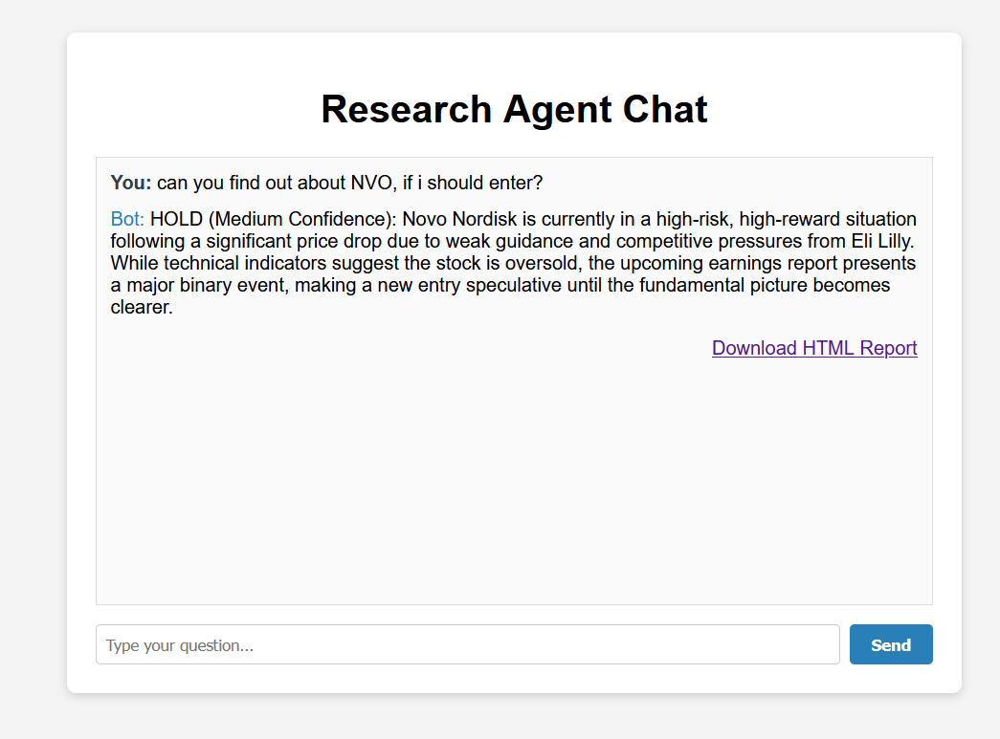

# Research Agent Chat

A web-based research assistant for stock analysis and report generation.

## Features
- Chat interface for research queries
- Generates HTML reports for stocks
- Example: See the screenshot and sample report below

## Setup Instructions

### 1. Clone the Repository
```
git clone <your-repo-url>
cd fundametal-research-agentic
```

### 2. Install Python Dependencies
```
pip install -r requirements.txt
```

### 3. Add Your Gemini API Key
Create a file named `.env` in the project root with the following content:
```
GEMINI_API_KEY=your_gemini_api_key_here
```

### 4. Run the Web UI
```
python webui.py
```
Then open your browser and go to: [http://127.0.0.1:7860](http://127.0.0.1:7860)

## Usage
- Type your research question in the chat box and press Send.
- Download the generated HTML report using the provided link.

## Example Screenshot



## Example HTML Report
[NVO_20250802_220811.html](attachments/NVO_20250802_220811.html)

---

**Note:**
- Make sure your `.env` file is not tracked by git (already handled in `.gitignore`).
- For security, never share your API key.
